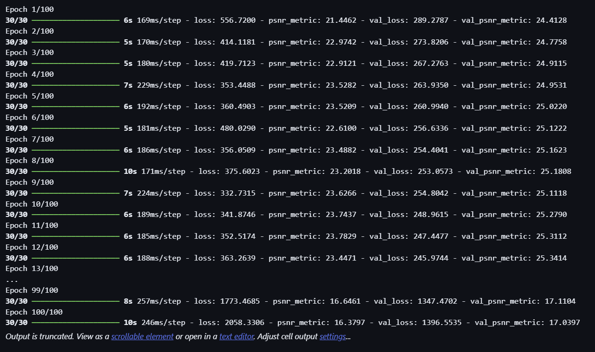
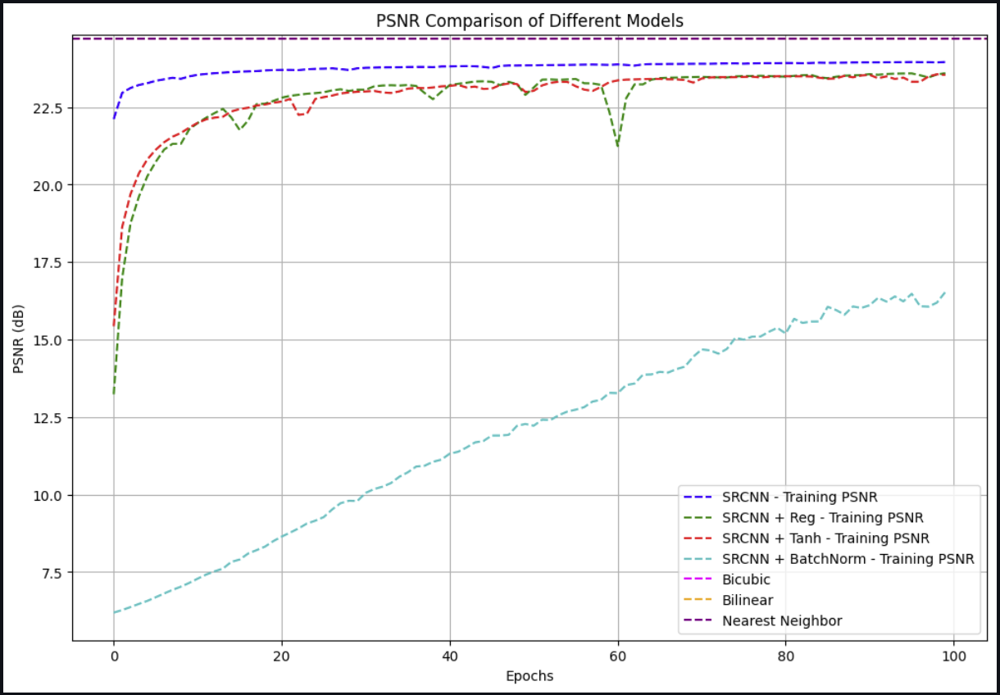
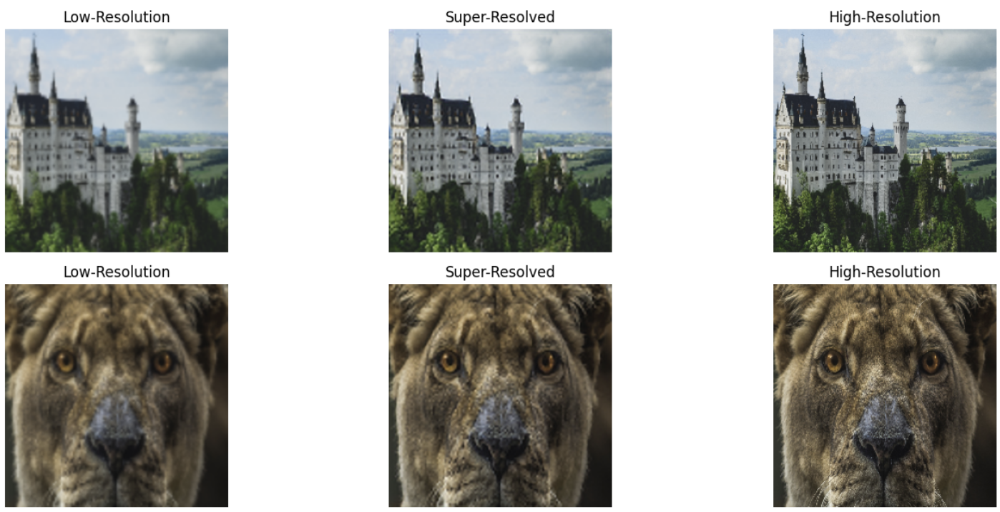

# Image-Super-Resolution

Projekat iz predmeta Mašinsko učenje, školske 2023/2024 godine na master studijama Matematičkog fakulteta.

Projekat koristi SRCNN kako bi poboljšao kvalitet slika niske rezolucije. Model je treniran na DIV2K dataset-u, a evaluacija modela se vršila korišcenjem Peak Signal-to-Nose Ratio (PSNR) metrike.

Autori: Miljan Bakić 1033/2023 i Stevan Dragović 1096/2023

Preduslovi:

<pre>
pip install -r requirements.txt
</pre>

Koraci:

1. Učitavanje i preprocesiranje DIV2K dataset-a
2. Treniranje SRCNN modela korišćenjem trening skupa
3. Evaluacija modela na test skupu PSNR metrikom

Treniranje modela:

Rezultati:

